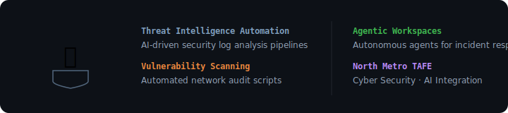

<div align="center">

# 🏫 C Y B E R S E C - A I - T A F E
### *Cyber Security & AI Academic Portfolio.*

[]()
[]()

**[🌐 Sideload Hub](https://earnerbaymalay.github.io/sideload/)**

</div>

---



## Overview

Centralized portfolio for coursework at **North Metro TAFE**, demonstrating practical applications of AI in modern Cyber Security workflows.

---

## Key Projects

### 🔍 Threat Intelligence Automation
AI-driven analysis of security logs. Automated pattern detection, anomaly identification, and alert generation from raw log data.

### 🛡️ Vulnerability Scanning
Custom scripts for automated network audits. Continuous monitoring and reporting of security posture across networked systems.

### 🤖 Agentic Workspaces
Implementing autonomous agents for incident response simulation. AI-driven playbooks that adapt to evolving threat scenarios.

---

## Getting Started

```bash
git clone https://github.com/earnerbaymalay/CYBERSEC-AI-TAFE-PROJECTS.git
cd CYBERSEC-AI-TAFE-PROJECTS
```

Browse individual project directories for scripts, analysis outputs, and documentation.

---

## Related Projects

<div align="center">

| Project | Platform | Description | Link |
|---------|----------|-------------|------|
| 🌌 **Aether** | 📱 Android (Termux) | Local-first AI workstation | [Source →](https://github.com/earnerbaymalay/aether) |
| 🛡️ **Cyph3rChat** | 📱 Android | E2E encrypted messaging | [Source →](https://github.com/earnerbaymalay/e2eecc) |
| 📲 **Sideload Hub** | 🌐 Web / PWA | Central app distribution | [Open Hub →](https://earnerbaymalay.github.io/sideload/) |

</div>

---

<div align="center">

*Advancing the intersection of Artificial Intelligence & Cyber Security.*

[MIT License](LICENSE)

</div>
